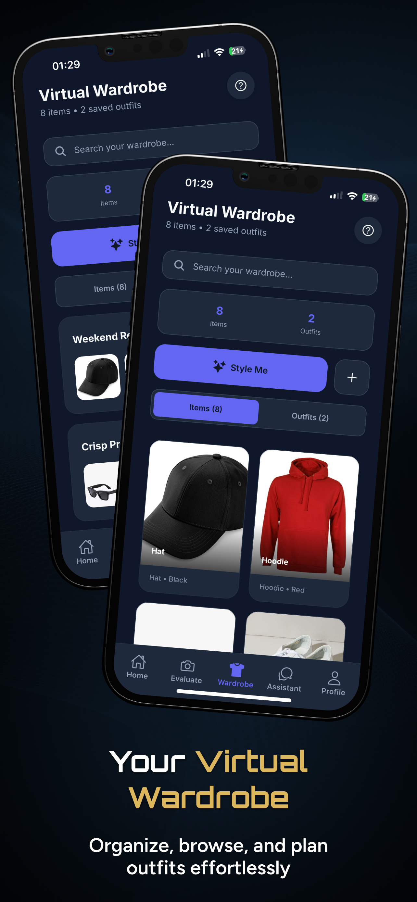
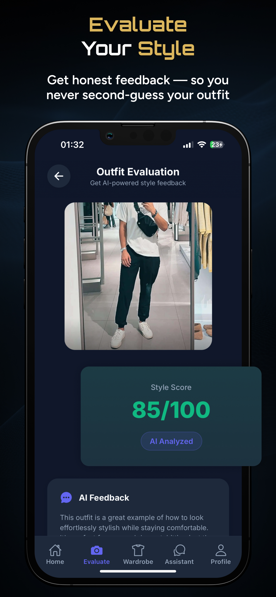
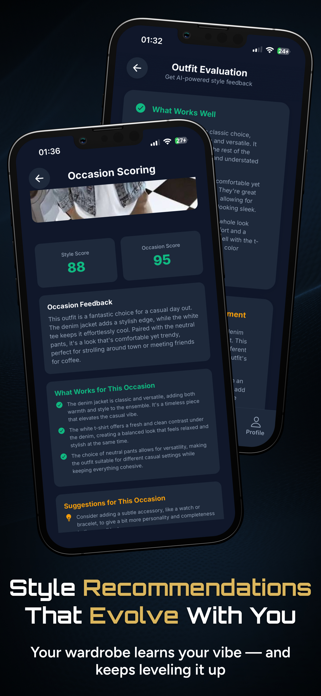
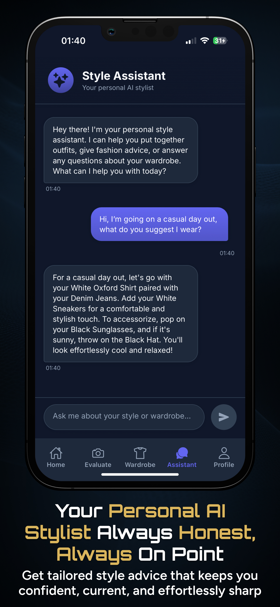
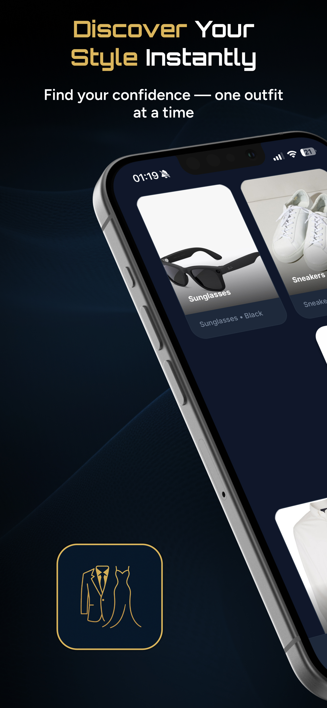
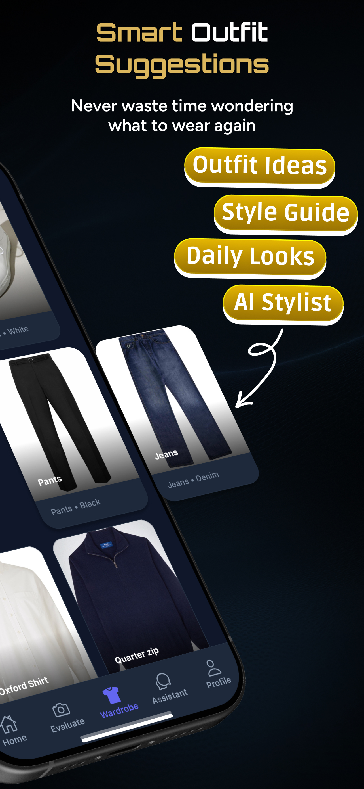
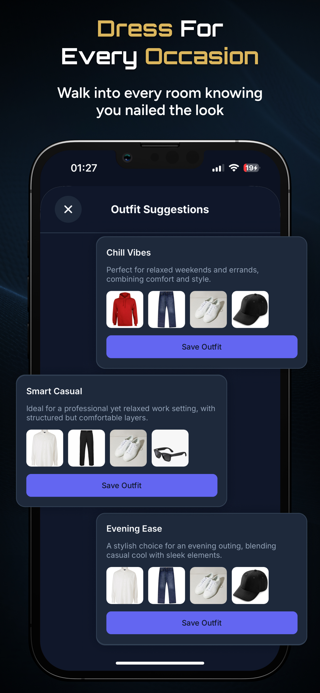
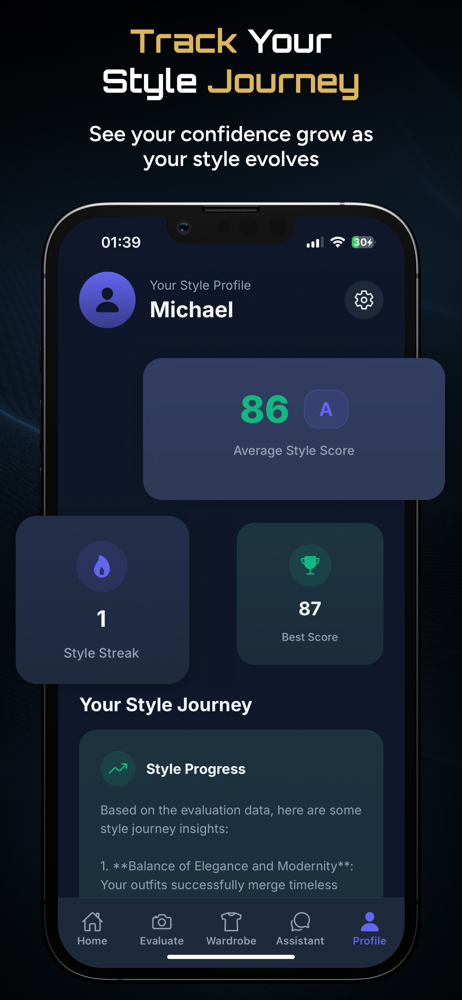
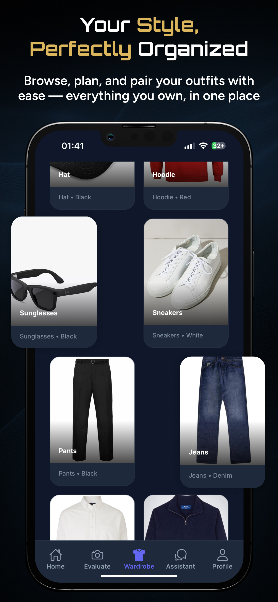
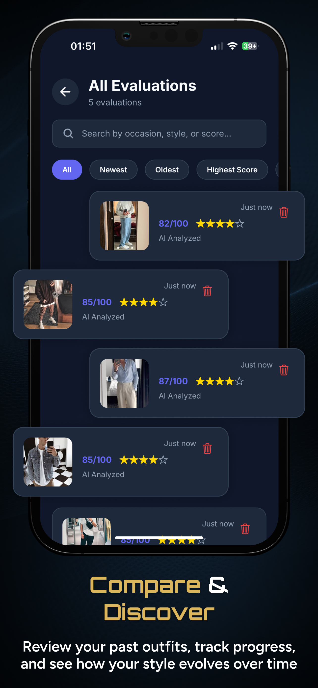

# Stylo

Stylo is an iOS-focused personal styling app built with React Native, TypeScript, Expo and Supabase. It brings together a virtual wardrobe, outfit feedback, occasion-based analysis, style history and subscriptions.

The original app was published on the iOS App Store, received multiple updates, and served real users and paying subscribers. This repository contains the app source, including its integration with an external multimodal AI model. Running all features requires your own backend and native app configuration; see [Setup](#setup).

## Screenshots

Promotional screenshots of the original app. The current portfolio version requires the [AI backend](#ai-backend) described below. Click any image to view it at full size.

| Virtual wardrobe | Outfit evaluation | Occasion scoring | Style assistant |
| :---: | :---: | :---: | :---: |
| <a href="assets/screenshots/virtual-wardrobe.jpg"></a> | <a href="assets/screenshots/outfit-evaluation.jpg"></a> | <a href="assets/screenshots/occasion-scoring.jpg"></a> | <a href="assets/screenshots/style-assistant.jpg"></a> |

<details>
<summary>View six more screenshots</summary>

| Style discovery | Wardrobe styling | Outfit suggestions |
| :---: | :---: | :---: |
| <a href="assets/screenshots/discover-your-style.jpg"></a> | <a href="assets/screenshots/wardrobe-styling.jpg"></a> | <a href="assets/screenshots/outfit-suggestions.jpg"></a> |

| Style profile | Wardrobe items | Evaluation history |
| :---: | :---: | :---: |
| <a href="assets/screenshots/style-profile.jpg"></a> | <a href="assets/screenshots/wardrobe-items.jpg"></a> | <a href="assets/screenshots/evaluation-history.jpg"></a> |

</details>

## Features

- Outfit photos from the camera or photo library, with persistent device-local image storage.
- User-specific wardrobe items, outfit combinations and evaluation history.
- Outfit and occasion analysis, wardrobe suggestions and contextual style chat.
- Supabase email/password authentication and persisted sessions.
- RevenueCat subscriptions, purchase restoration and iOS StoreKit integration.
- Onboarding, themes, styling hints and local notifications.

## Architecture

The app uses React 19, React Native 0.79 and Expo SDK 53. React Navigation provides the screen stack and bottom tabs. Supabase supplies authentication and PostgreSQL; RevenueCat manages native subscription entitlements.

| Area | Main files | Responsibility |
| --- | --- | --- |
| App and navigation | [App.tsx](App.tsx), [MainTabNavigator.tsx](navigation/MainTabNavigator.tsx) | Providers, onboarding, auth/subscription gates and navigation |
| Authentication | [SupabaseAuthContext.tsx](src/context/SupabaseAuthContext.tsx), [ImprovedAuthScreen.tsx](screens/ImprovedAuthScreen.tsx) | Signup/login, session restoration and auth-state changes |
| Data access | [useSupabaseDB.ts](hooks/useSupabaseDB.ts), [SQL migration](supabase/migrations/001_initial_schema.sql) | User-specific CRUD and database row ownership |
| AI | [aiService.ts](services/aiService.ts), [aiTransport.ts](services/aiTransport.ts), [aiValidation.ts](services/aiValidation.ts) | Prompts, multimodal messages, backend calls and response validation |
| Images | [imageService.ts](services/imageService.ts) | Permissions, image selection, base64 input and local file copies |
| Subscriptions | [paymentService.ts](services/paymentService.ts), [SubscriptionContext.tsx](context/SubscriptionContext.tsx) | Offerings, purchases, restore and entitlement updates |

An outfit photo flows from the image picker into a multimodal request, then through response validation before an evaluation can be displayed or saved. Invalid responses produce an error instead of a generated substitute score. Wardrobe combinations can also be evaluated from item descriptions; this is distinct from photo analysis.

## Setup

Use a Node.js version compatible with Expo SDK 53 and Yarn Classic 1.22. Native iOS work also requires macOS, Xcode and CocoaPods.

```sh
yarn install --frozen-lockfile
cp .env.example .env.local
```

Set the three public client configuration values in `.env.local`:

| Variable | Value |
| --- | --- |
| `EXPO_PUBLIC_SUPABASE_URL` | Your development Supabase project URL |
| `EXPO_PUBLIC_SUPABASE_ANON_KEY` | Your Supabase publishable or anon key |
| `EXPO_PUBLIC_REVENUECAT_API_KEY` | Your RevenueCat public iOS SDK key |

Create a development Supabase project, enable email authentication and apply [the schema](supabase/README.md) once. Configure your RevenueCat products and current offering with the entitlement ID `pro`.

```sh
yarn start
```

Restart Metro after environment changes. Expo Go supports development-only mock payments; real purchases require a configured native build.

### Native builds

The included iOS source has a Podfile but no Xcode project/workspace. Restore the original project or back up the native source and review a regenerated Expo iOS project before building. The portfolio uses `com.example.stylo` as its example app identifier, with matching Android namespace and source packages. Before distributing a build, choose your own identifier and align Expo/native configuration, signing and RevenueCat. This identity is separate from the previously published app. The `stylo` and `user-app` URL schemes are registered; configure any authentication redirect allowlist for your development backend accordingly.

After native setup, use `yarn ios` or `yarn android`. Android scaffolding is included, but Android subscriptions are not configured. Its local debug keystore is excluded and must be regenerated for development. Web is a secondary, unverified runtime target.

### AI backend

The client expects an authenticated Supabase Edge Function named `stylo-ai`. **The function is not included in this repository; AI requests fail until a compatible backend is implemented.**

The request body is `{ messages: [...] }`; the successful response is `{ text: string }`. Messages use `system`, `user` and `assistant` roles, with either text content or text/image parts. Image parts contain base64 data. The client checks its session and applies a 60-second timeout.

The server must verify user tokens, validate message/image sizes and types, enforce durable per-user quotas and a spend limit, and keep provider credentials, model selection and the upstream URL server-side. Convert image parts to the provider's required format. Return generic errors and avoid logging photos, prompts or tokens. Paid limits must use server-verified entitlements. Guest AI access is not implemented.

## Checks

```sh
yarn typecheck
yarn test
yarn lint
```

Tests cover invalid AI output, missing scores, provider failures, unknown wardrobe items, guest denial, safe error messages and production purchase failures. They run without contacting live services. An iOS JavaScript bundle export has been checked; that is separate from a native Xcode build or StoreKit test.

## Security and limitations

- Every `EXPO_PUBLIC_*` value is visible in the app. Provider secrets, Supabase service-role keys and other administrative credentials belong only on the server. Database RLS policies enforce user ownership; client filters alone do not authorize access.
- Images currently use device-local URIs, so cloud records do not provide cross-device image sync. Sessions are persisted with AsyncStorage.
- Database read failures currently return empty results. Multi-step evaluation/stat writes are not transactional, and guest-to-account data migration is not implemented in the active data layer.
- Account deletion references a `delete_user` RPC absent from the included schema. RevenueCat identities are not explicitly linked to Supabase user IDs; account switching needs further native testing.
- Dependency advisories and lint warnings remain. A coordinated Expo/React Native upgrade and further integration tests are planned improvements. Hosted RLS, real purchases and backend behavior must be verified against your own development services.
